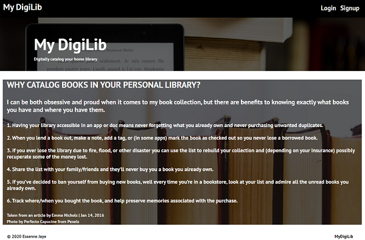
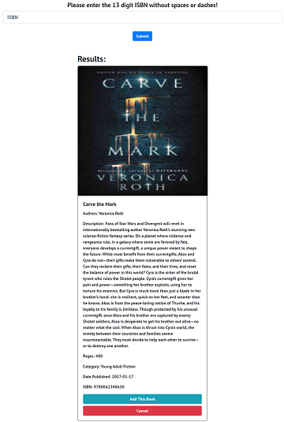
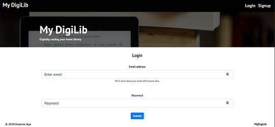
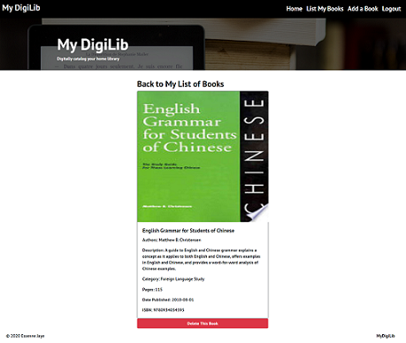
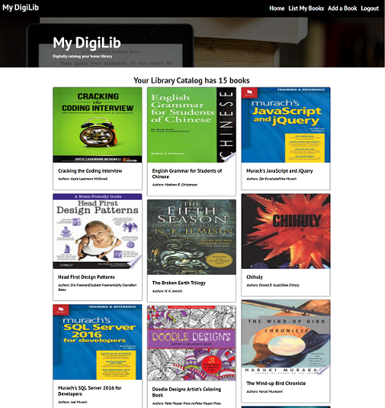
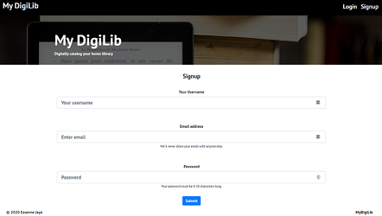

# My DigiLib
Digitally Catalog Your Home Library

  ## Table of Contents
  ### <a href='#description'>Description</a>
  ### <a href='#installation'>Installation</a>
  ### <a href='#usage'>Usage</a>
  ### <a href='#technologies'>Technologies Used</a>   
  ### <a href='#questions'>Questions</a>
  ### <a href='#screenshots'>Screenshots</a>
  ### <a href='#codesnippets'>Code Snippets</a>
  
  ## Description
  * An node.js application to digitally catalog your home library. It performs a search for your book based on the ISBN.
  
  ## Installation
  * This project is deployed on Heroku at https://mydigilib.herokuapp.com.
  
  ## Usage
  * The user is required to sign up by providing a username, email and password. 
  * The user may login by providing their email and username.
  * Once an account has been established, the user may add books to their database library by entering the 10 or 13   digit ISBN on the Add Book ISBN page. 
  * The user may also manually add a book to the catalog by entering information for a book on the Add Manual Book page.
  * The application searches the Google books API for a match and if one is found it displays the result. 
  * The user then has the option to add the book to their database or cancel the transaction. 
  * A user may list the contents of their library from the List My Books page. The user may also select an individual book to view and the user may delete the book from the single book page. 
  * When the user has finished entering books, they may log out.
  
  ## Technologies Used
  * Front-end
    - React
    - React bootstrap
    - styled componets
    - Apollo server library
    
  * Back-end
    - MongoDB
    - Mongoose
    - Graphql
    - Express
    
  ## Questions
  * For answers to common questions about this project please see my GitHub repository at https://github.com/essennejaye or send questions to essennejaye@outlook.com.
    
  ## Screenshots





  
    
  ## Code Snippets
  ````
   Mutation: {
      addUser: async (parent, args) => {
        const user = await User.create(args);
        const token = signToken(user);
        return { token, user };
      },

      login: async (parent, { email, password }) => {
        const user = await User.findOne({ email });

        if (!user) {
          throw new AuthenticationError('Incorrect credentials');
        }
        const correctPw = await user.isCorrectPassword(password);
        if (!correctPw) {
          throw new AuthenticationError('Incorrect credentials');
        }
        const token = signToken(user);
        return { token, user };
      },

      addBook: async (parent, { bookData }, context) => {
        if (context.user) {
          const book = await Book.create({ ...bookData });
          return book;
        }
        throw new AuthenticationError('You need to be logged in!');
      },
      
const Header = () => {
  const logout = event => {
    event.preventDefault();
    Auth.logout();
  }
  return (
    <>
      <Styles>
        <Navbar expand='lg'>
          <Navbar.Brand as={StyledLink} to='/'><h2>My DigiLib</h2></Navbar.Brand>
          <Navbar.Toggle aria-controls="basic-navbar-nav" />
          <Navbar.Collapse id="basic-navbar-nav">
            <Nav className="ml-auto">
              {Auth.loggedIn() ? (
                <>
                  <Nav.Link as={StyledLink} to='/'>Home
                  </Nav.Link>
                  <Nav.Link as={StyledLink} to={`/books/${localStorage.getItem('user_id')}`}>List My Books
                  </Nav.Link>
                  <DropdownButton id="dropdown-basic-button" title="Add New Books">
                    <Dropdown.Item href='/addbookisbn' className='drop-item'>Search for Books with ISBN</Dropdown.Item>
                    <Dropdown.Item href='/addbookmanual' className='drop-item'>Add Books Manually</Dropdown.Item>
                  </DropdownButton>
                  <Nav.Link as={StyledLink} to='/' onClick={logout}>Logout
                  </Nav.Link>
                </>
              ) : (
                  <>
                    <Nav.Link as={StyledLink} to='/login'>Login
                    </Nav.Link>
                    <Nav.Link as={StyledLink} to='/signup'>Signup
                    </Nav.Link>
                  </>
                )}
            </Nav>
          </Navbar.Collapse>
        </Navbar>
      </Styles>
    </>
  );
};
export default Header;
````
  
   
  
